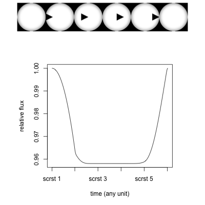
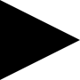
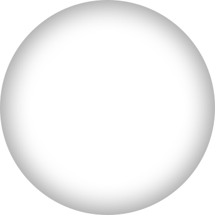

# fluxgrapher

This application let’s you upload jpg or png files with a maximum height of 360px that represent an occulting object in front of a star that has a diameter of 360px. The output of this application is a graph of the relative flux of the star that will be observed when the uploaded objects transits the star at a constant velocity.

### Example output of the app
A relative flux graph corresponding to a transit of the example input file

### Example input file
(real size)

### Used star
(real size)
The used image of the star. This is just a circle with an inner shadow to imitate lim darkening. It is not an actual observation of a star at a given spectrum.

